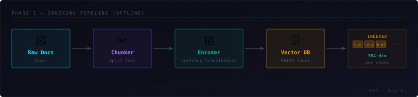
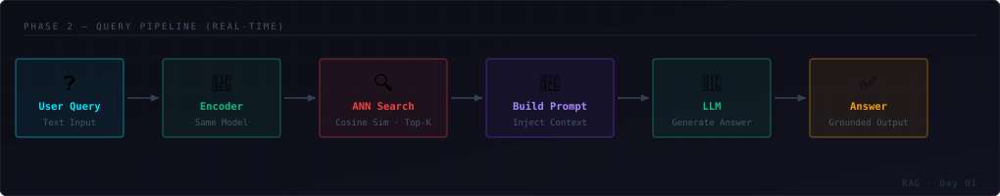
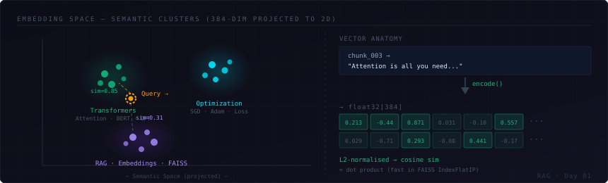
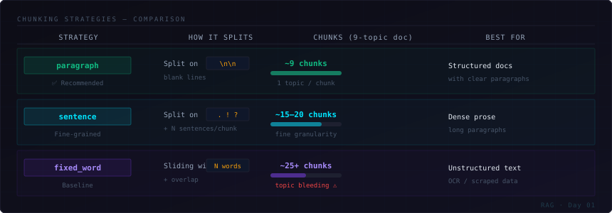

<div align="center">

```
┌─────────────────────────────────────────────────┐
│   LEARNING SERIES · DAY 01                       │
│                                                  │
│   R A G   F R O M   S C R A T C H               │
│   Retrieval-Augmented Generation                 │
└─────────────────────────────────────────────────┘
```

[](https://python.org)
[](https://sbert.net)
[](https://github.com/facebookresearch/faiss)
[](LICENSE)

A clean, minimal, zero-magic implementation of a RAG pipeline built from first principles.  
No LangChain. No abstractions. Every component written and explained from scratch.

</div>

---

## What is RAG?

RAG stands for **Retrieval-Augmented Generation**. Instead of relying solely on an LLM's training data (which can be outdated or hallucinated), RAG:

1. **Indexes** your documents as dense vectors in a knowledge base
2. **Retrieves** the most semantically relevant chunks at query time
3. **Augments** the LLM prompt with those chunks as grounded context
4. **Generates** a factual, cited answer

The result: an LLM that answers from *your* data, not its imagination.

---

## Architecture

### Phase 1 — Indexing Pipeline *(offline, runs once)*



| Step | Component | What happens |
|------|-----------|--------------|
| 1 | `loader.py` | Read raw `.txt` files from `data/` |
| 2 | `chunker.py` | Split documents into overlapping chunks |
| 3 | `embedder.py` | Encode each chunk → 384-dim float32 vector |
| 4 | `vector_store.py` | Store vectors in FAISS `IndexFlatIP` |

---

### Phase 2 — Query Pipeline *(real-time, runs per query)*



| Step | Component | What happens |
|------|-----------|--------------|
| 1 | User Input | Raw natural language question |
| 2 | `embedder.py` | Encode query with the **same model** |
| 3 | `vector_store.py` | Cosine similarity search → Top-K chunks |
| 4 | `retriever.py` | Build context string from retrieved chunks |
| 5 | LLM *(Day 02+)* | Generate grounded answer |

---

### Embedding Space



Each chunk becomes a point in 384-dimensional space. Semantically similar content clusters together — so a query about "attention mechanisms" lands near transformer-related chunks, not gradient descent chunks.

> **Key insight:** We use `normalize_embeddings=True` in sentence-transformers so all vectors are L2-normalised. This means **cosine similarity = dot product**, which is what FAISS `IndexFlatIP` computes — making retrieval both exact and fast.

---

## Chunking Strategies

The single biggest lever in RAG quality is **how you split your documents**.



### Why chunking matters

```
chunk too large  →  topics bleed together  →  retrieval is noisy
chunk too small  →  context is fragmented  →  LLM lacks enough info
                          ↑
               sweet spot depends on your data
```

This project implements all three strategies in `rag/chunker.py`:

**`paragraph`** — split on blank lines *(recommended)*
```python
chunks = chunk_documents(docs, strategy="paragraph", min_words=10)
# 9-topic doc → ~9 chunks, one per topic ✅
```

**`sentence`** — group N sentences with overlap
```python
chunks = chunk_documents(docs, strategy="sentence", sentences_per_chunk=3, overlap_sentences=1)
# 9-topic doc → ~15–20 chunks, finer granularity
```

**`fixed_word`** — sliding window over words
```python
chunks = chunk_documents(docs, strategy="fixed_word", chunk_size=40, overlap=10)
# 9-topic doc → ~25+ chunks, ignores structure ⚠️
```

---

## Project Structure

```
rag-from-scratch/
│
├── data/
│   └── sample_docs.txt          ← 9-topic ML knowledge base
│
├── rag/
│   ├── __init__.py
│   ├── loader.py                ← load & clean documents
│   ├── chunker.py               ← 3 chunking strategies
│   ├── embedder.py              ← sentence-transformers encoder
│   ├── vector_store.py          ← FAISS / NumPy index
│   └── retriever.py             ← query → top-K chunks
│
├── assets/                      ← SVG architecture diagrams
│   ├── indexing_pipeline.svg
│   ├── query_pipeline.svg
│   ├── chunking_strategies.svg
│   └── embedding_space.svg
│
├── main.py                      ← original end-to-end demo
├── main_v2.py                   ← strategy comparison demo
└── requirements.txt
```

---

## Quick Start

```bash
# 1. Clone and enter
git clone https://github.com/yourname/rag-from-scratch.git
cd rag-from-scratch

# 2. Install dependencies
pip install -r requirements.txt

# 3. Run the basic pipeline
python main.py

# 4. Compare all three chunking strategies
python main_v2.py
```

### Expected output (`main.py`)

```
[Loader] Loaded: sample_docs.txt (3241 chars)
✅ Step 1: Loaded 1 document(s).
✅ Step 2: Created 9 chunk(s).
[Embedder] Loading 'all-MiniLM-L6-v2' ...
[Embedder] Ready. Embedding dim = 384
✅ Step 3: Embeddings shape: (9, 384)
[VectorStore] Added 9 vectors. Total: 9
✅ Step 4: Indexed 9 vectors.

🔍 "What is the attention mechanism in transformers?"
────────────────────────────────────────────────────
  [1] score=0.8821  → Transformers are a type of deep learning model introduced...
  [2] score=0.5103  → The attention mechanism works by computing three vectors...

🔍 "How does gradient descent optimization work?"
────────────────────────────────────────────────────
  [1] score=0.8934  → Gradient descent is an optimization algorithm used to minimize...
  [2] score=0.4412  → Stochastic Gradient Descent (SGD) computes the gradient using...
```

---

## Model: `all-MiniLM-L6-v2`

| Property | Value |
|----------|-------|
| Dimensions | 384 |
| Parameters | ~22M |
| Max sequence length | 256 tokens |
| Speed | ~14,200 sentences/sec (CPU) |

Swap it in `embedder.py` for a quality/speed tradeoff:

| Model | Dims | Quality | Speed |
|-------|------|---------|-------|
| `all-MiniLM-L6-v2` | 384 | Good | ⚡⚡⚡ Default |
| `all-mpnet-base-v2` | 768 | Better | ⚡⚡ |
| `BAAI/bge-small-en-v1.5` | 384 | Better | ⚡⚡⚡ |
| `intfloat/e5-large-v2` | 1024 | Best | ⚡ |

---

## Key Concepts

<details>
<summary><strong>Why normalize embeddings?</strong></summary>

When we set `normalize_embeddings=True`, each vector is divided by its L2 norm so `||v|| = 1`. The cosine similarity between two unit vectors is just their dot product:

```
cosine_sim(a, b) = (a · b) / (||a|| × ||b||) = a · b   (when ||a|| = ||b|| = 1)
```

FAISS `IndexFlatIP` computes inner products (dot products). By normalising first, we get exact cosine similarity with the fastest possible index — no separate cosine index needed.

</details>

<details>
<summary><strong>Why overlap in chunking?</strong></summary>

If a key sentence spans a chunk boundary, splitting without overlap means both chunks are missing context. Overlap ensures the sentence appears fully in at least one chunk:

```
Chunk A:  [...sentence1,  sentence2,  sentence3]
                                      ↑ overlap
Chunk B:                 [sentence3,  sentence4,  sentence5]
```

For `sentence` chunking with `overlap_sentences=1`, the last sentence of every chunk is the first sentence of the next — preserving context at every boundary.

</details>

<details>
<summary><strong>FAISS vs NumPy fallback</strong></summary>

`vector_store.py` auto-detects FAISS availability:

```python
try:
    import faiss
    # IndexFlatIP: exact inner product search
except ImportError:
    # numpy fallback: matrix @ query.T  (identical results, slower at scale)
```

Both return identical results. FAISS is ~10–100x faster at 10k+ vectors. For learning with small datasets, the NumPy path works perfectly — no install required.

</details>

<details>
<summary><strong>Dense vs sparse retrieval</strong></summary>

| | Dense (this project) | Sparse (BM25, TF-IDF) |
|--|--|--|
| Representation | Float32 vector | Sparse term weights |
| Handles synonyms | ✅ Yes | ❌ No |
| Handles exact keywords | ⚠️ Weaker | ✅ Strong |
| Needs a trained model | ✅ (pre-trained) | ❌ (statistical) |
| Speed at scale | Fast with ANN index | Fast with inverted index |

Production RAG systems typically use **hybrid retrieval** — combining dense and sparse for the best of both.

</details>

---

## Requirements

```
sentence-transformers==2.7.0
faiss-cpu==1.8.0
numpy>=1.24
rich
```

Python 3.10+ recommended. FAISS is optional — the pipeline falls back to NumPy automatically if it's not installed.

---

<div align="center">

Built for learning · No magic · Every line explained

</div>
